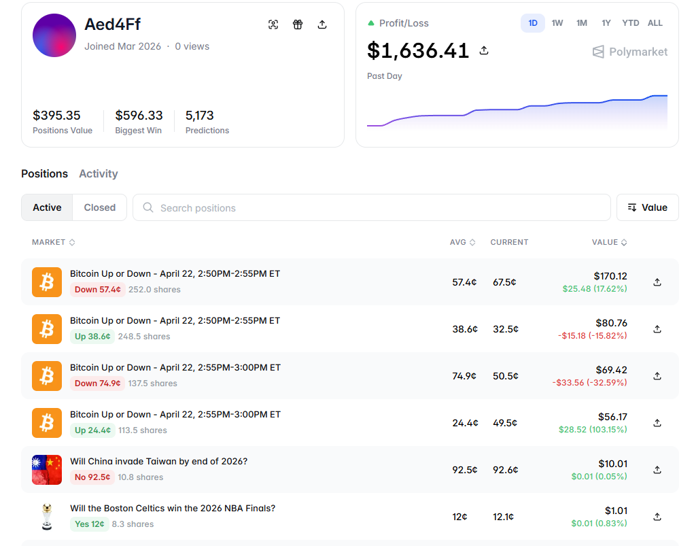

# Polymarket Trading Bot (Rust)

Rust trading automation for Polymarket short-horizon crypto and related markets. The workspace ships multiple binaries: dual-limit starters, a trailing stop strategy, backtests, and small utilities to validate balance, allowance, orders, merge, and redemption against the CLOB.

## Overview

The bot loads a JSON config and optional `.env` secrets, authenticates to Polymarket’s CLOB (including proxy wallet modes), and runs strategies with simulation, live, or backtest / history-replay options. A native CLOB SDK is loaded at runtime; Linux deployments should use SDK builds matched to the host glibc (or Docker).

---



---

https://github.com/user-attachments/assets/9e20bab4-431e-4f8d-8a69-147a34b7ea3b

---

### Key features

- **Multiple strategies**: Default dual-limit entry binaries, 5-minute BTC variant, and trailing-stop style execution.
- **Simulation and backtest**: Paper mode and backtest / history file replay for strategy validation.
- **Asset flags**: Configurable enablement of BTC, ETH, Solana, and XRP market families where implemented.
- **Utilities**: `test_*` binaries for cash balance, allowance, limits, sell, merge, redeem, and multi-order checks.
- **Container-friendly**: `Dockerfile` for environments where glibc and bundled SDK layout must match.

## Architecture

### Technology stack

- **Runtime**: Rust (see `rust-toolchain.toml` / `Cargo.toml` for MSRV relative to `alloy` and dependencies; **rustc 1.91+** is expected for this tree)
- **Async**: Tokio
- **Chain**: Polygon (and compatible EVM usage via configuration)
- **HTTP / WS**: `reqwest`, `tokio-tungstenite` where used
- **CLOB access**: Native SDK loaded via `libloading` (see [Technical details](#technical-details--clob-sdk))
- **Config**: `config.json` (non-secrets) plus `.env` for keys (see [Installation](#installation))

### System flow

```
Load config + .env → L1/L2 CLOB auth → Market polling / strategy
→ Order placement (or simulation) → Logs + optional history / backtest
```

## Installation

### Prerequisites

- **Rust and Cargo** via [rustup](https://rustup.rs/); this repo targets **stable** and requires a recent enough `rustc` (e.g. **1.91+** for current dependencies).
- **Polymarket CLOB SDK shared library** on the library path: versioned `lib/libclob_sdk-ubuntu-22.04.so` and `lib/libclob_sdk-ubuntu-24.04.so` on Linux, or `libclob_sdk.dylib` / `clob_sdk.dll` on macOS / Windows, or set `LIBCOB_SDK_SO` to an explicit path.
- A funded wallet and USDC for live trading, with keys supplied only through environment (never commit them).

### Setup

1. **Clone the repository and enter the directory**

   ```bash
   git clone <repository-url>
   cd Polymarket-Trading-Bot-Rust
   ```

2. **Build**

   ```bash
   cargo build --release
   ```

3. **Configure `config.json`**

   ```bash
   cp config.example.json config.json
   ```

   Edit `config.json` for trading intervals, enabled assets, dual-limit parameters, and base API URLs. Prefer **not** pasting `private_key` in the file; use `.env` instead.

4. **Configure `.env`**

   ```bash
   # RUST_LOG=info
   POLYMARKET_PRIVATE_KEY=0xYOUR_KEY
   POLYMARKET_SIGNATURE_TYPE=2
   POLYMARKET_PROXY_WALLET_ADDRESS=0xYOUR_PROXY_OR_SAFE
   POLYMARKET_API_KEY_NONCE=0
   # Optional: LIBCOB_SDK_SO=/absolute/path/to/libclob_sdk.so
   ```

5. **Docker (optional, Linux / glibc alignment)**

   ```bash
   docker build -t polymarket-trading-bot .
   docker run --rm -it --env-file .env \
     -v "$(pwd)/config.json:/app/config.json:ro" \
     polymarket-trading-bot
   ```

## Configuration

### `config.json` (summary)

| Section | Role |
|---------|------|
| `polymarket` | `gamma_api_url`, `clob_api_url`, optional inline secrets (prefer env) |
| `trading` | Polling, dual-limit price/shares, hedge timing, trailing options, and `enable_*_trading` flags |

See `config.example.json` for the full shape.

### Environment variables (common)

| Variable | Description |
|----------|-------------|
| `POLYMARKET_PRIVATE_KEY` | Hex private key (with or without `0x`) for live auth and orders |
| `POLYMARKET_SIGNATURE_TYPE` | `0` EOA, `1` proxy, `2` browser / Safe style proxy (typical for MetaMask + Polymarket proxy) |
| `POLYMARKET_PROXY_WALLET_ADDRESS` | Funder / proxy when using types 1 or 2 |
| `POLYMARKET_API_KEY` / `SECRET` / `PASSPHRASE` | Optional cached L2 API credentials; otherwise derived via L1 auth |
| `POLYMARKET_API_KEY_NONCE` | Optional nonce for stable derived API keys |
| `LIBCOB_SDK_SO` | Override path to the CLOB SDK shared library |
| `RUST_LOG` | Log level: `error`, `warn`, `info`, `debug`, `trace` |

### CLI (see `src/config.rs` `Args`)

| Flag | Role |
|------|------|
| `--config` | Path to JSON config (default `config.json`) |
| `--simulation` / `-s` | Simulation (no real trades) where applicable |
| `--no-simulation` | Force live mode |
| `--backtest` | Backtest mode |
| `--history-file` | Replay a `history/*.toml` file |

## Usage

### Default binary (`default-run` in `Cargo.toml`)

```bash
cargo run --release -- --config config.json
```

### Dual-limit (example)

```bash
cargo run --release --bin main_dual_limit_045_same_size -- --config config.json --no-simulation
```

```bash
cargo run --release --bin main_dual_limit_045_5m_btc -- --config config.json
```

### Trailing and backtest

```bash
cargo run --release --bin main_trailing -- --config config.json
cargo run --release --bin backtest -- --config config.json
```

### Helper binaries

```bash
cargo run --release --bin test_allowance -- --config config.json
cargo run --release --bin test_limit_order -- --config config.json
cargo run --release --bin test_merge -- --config config.json
cargo run --release --bin test_redeem -- --config config.json
cargo run --release --bin test_sell -- --config config.json
cargo run --release --bin test_predict_fun -- --config config.json
```

See `Cargo.toml` `[[bin]]` for registered binary names.

## Technical details

### CLOB SDK

- The bot loads a **native** Polymarket CLOB client; **GLIBC** mismatches (e.g. `.so` built on Ubuntu 24.04 on an Ubuntu 22.04 host) are **not** fixed by changing the Rust toolchain. Use versioned `lib/` artifacts, `LIBCOB_SDK_SO`, Docker, or an SDK built on the same glibc as production.
- Authentication follows Polymarket CLOB L1 → L2 credential derivation; see official CLOB documentation.

### Strategy notes (high level)

- **Dual-limit flows**: Post paired limits, then hedge the unfilled side after configured minutes and price conditions.
- **Trailing**: Uses trailing stop and position sizing from `trading` in `config.json`.
- Modes and exact thresholds vary by binary; read the corresponding `src/bin/*.rs` for entry points.

## Project structure

```
Polymarket-Trading-Bot-Rust/
├── public/
│   ├── trading-rust.png       # README / demo still (add asset)
│   └── trading-rust.mp4       # optional local demo
├── lib/                       # CLOB SDK .so / .dylib / .dll (not always in repo)
├── history/                   # local price history / replay (gitignored)
├── src/
│   ├── lib.rs
│   ├── config.rs
│   ├── clob_sdk.rs
│   ├── api.rs
│   ├── trader.rs
│   ├── monitor.rs
│   ├── detector.rs
│   ├── merge.rs
│   ├── rtds.rs
│   ├── backtest.rs
│   ├── simulation.rs
│   ├── term_ui.rs
│   ├── models.rs
│   └── bin/
│       ├── main_dual_limit_045_same_size.rs
│       ├── main_dual_limit_045_5m_btc.rs
│       ├── main_trailing.rs
│       ├── backtest.rs
│       └── test_*.rs
├── config.example.json
├── rust-toolchain.toml
├── Cargo.toml
├── Dockerfile
└── README.md
```

## API integration

- **Gamma** and **CLOB** HTTP endpoints are configured in `config.json` under `polymarket.*`.
- Orders and market data go through the loaded CLOB SDK and supporting Rust modules in `src/`.

## Monitoring and logging

- Use `RUST_LOG` for `env_logger` output levels.
- Review stderr / stdout and any container logs for auth and SDK load errors before debugging strategy logic.

## Change history

Maintenance notes worth tracking in this repo:

1. **Rust / alloy MSRV**: Dependency upgrades can raise the minimum `rustc` beyond upstream SDK baselines.
2. **Native SDK path**: `LIBCOB_SDK_SO` and `lib/` layout are deployment-specific; document the host OS when sharing issues.

## Risk considerations

1. **Market and liquidity**: Volatility and thin books can cause partial fills and slippage.
2. **Execution**: Resting and aggressive orders may not fill as modeled in backtest.
3. **Fees and gas**: Affect net PnL.
4. **API limits**: Throttling or outages can block trading or redemption.
5. **Native library**: A wrong or missing SDK prevents startup entirely.

**Operational suggestions**: Prove simulation and backtest first, use Docker when glibc is uncertain, and keep API keys and `config.json` out of version control if they hold secrets.

## Development

```bash
cargo check
cargo build --release
```

## Support

Use repository issues for bugs and feature requests. For CLOB and Gamma behavior, use Polymarket’s official documentation.

---

**Disclaimer**: This software is provided as-is, without warranty. Prediction markets and digital assets involve substantial risk of loss. Use only capital you can afford to lose and comply with applicable laws in your jurisdiction.

**Version**: 0.1.0  
**Last updated**: April 2026
